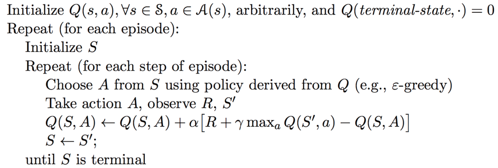
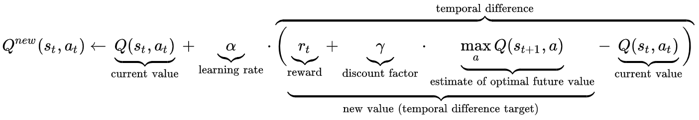
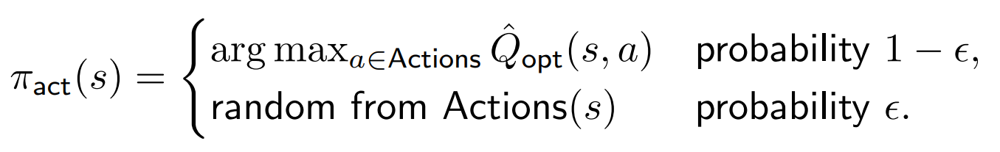

#### Easy21 Game

Reference codes in python. If you find any mistake, please correct it and contact with teaching assistants.

libraries you may need to install (not necessary):

```
pip install xxx
numpy, pandas, seaborn, matplotlib
```

##### Structure

`environment.py`: define the environment. Inspired by https://github.com/Matyyas/Easy21/blob/master/notebook_easy21.ipynb.

`q-learning-incomplete.py`: please fill up missing codes of Q-learning.

`play.py`: use your best policy learned by Q-learning and play with the dealer.

##### Requirements

Implement the *epsilon_greedy_policy* and *get_greedy_policy* functions. You can also drop the *epsilon_greedy_policy* function and modify some codes to always use the *get_greedy_policy* functions.

Fill up the *q_learning* function.

##### Key formulations

Q-learning:





If we reach the final state, $max_a Q(s_{t+1}, a)$ is equal to 0.

$\epsilon$-greedy:



If $\epsilon$ is equal to 0, then it becomes the greedy policy (always choose the action with the largest Q value).

